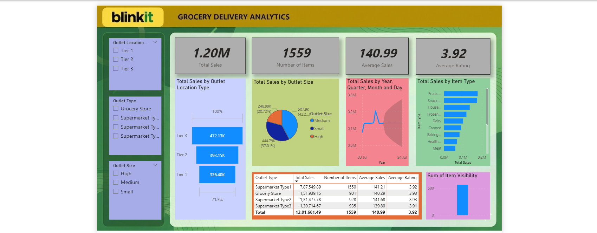

# 📊 Blinkit Power BI Dashboard
This project analyzes Blinkit sales, orders, and performance using Power BI.

## 📌 Problem Statement
To analyze Blinkit's sales performance and identify trends, top categories, and regional insights.

## 🚀 Features
- Total Sales KPI
- Category-wise analysis
- Outlet performance
- Monthly sales trends

- ## 📷 Dashboard Preview

## 🛠 Tools Used
- Power BI
- Excel

- ## 📊 Key Insights
- Fruits & Vegetables category has highest sales
- Tier 1 cities generate maximum revenue
- Sales peak during weekends

- ## 📂 Files Included
- power_bi_blinkit.pbix
- dashboard.png

- ## ▶️ How to Use
Download the .pbix file and open in Power BI Desktop.
